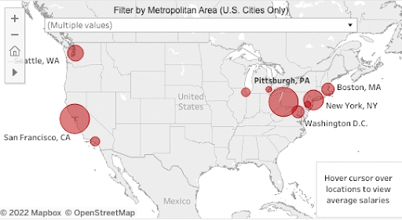
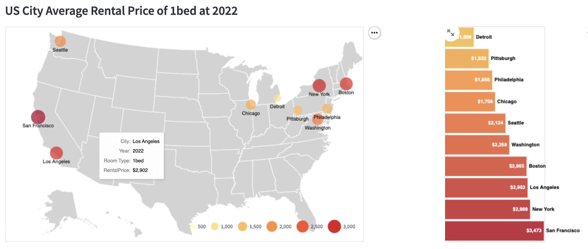
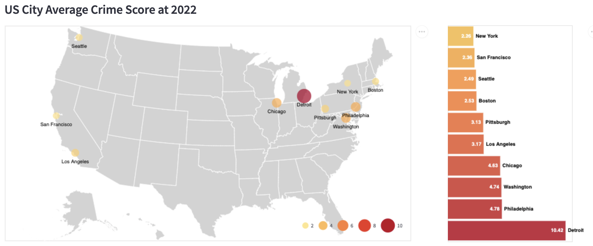
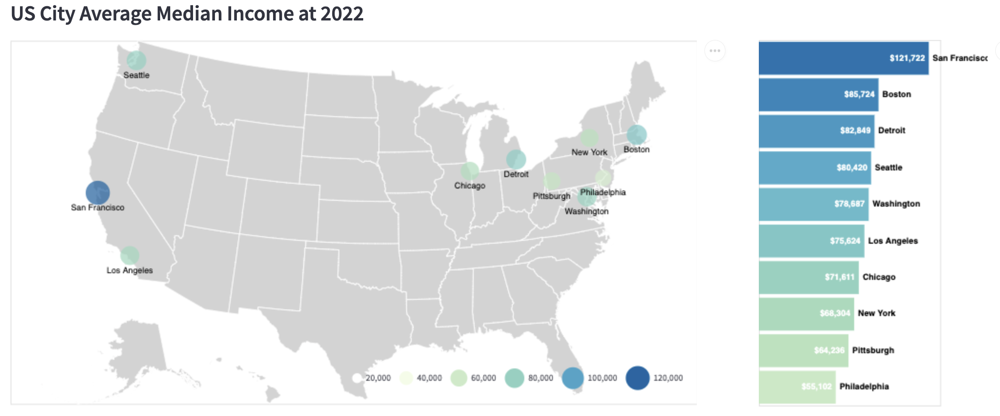

# Final Project Report

* **Project URL**: https://share.streamlit.io/cmu-ids-2022/final-project-champion/main/app.py
* **Video URL**: [Final video in repo](Champion_IDS_final_video.mov) 
	- Back up link live on [vimeo](https://vimeo.com/704280556)

**Abstract**: The pandemic has caused many uncertainties in the United States. Also, it has provided the flexibility for many employees to work remotely anywhere. Given that many students are graduating from Carnegie Mellon University (CMU) soon, they may have the opportunity to work remotely anywhere they want to. As such, which location should these students choose and how much should they pay and lease for given how dynamic the rental prices have been due to the pandemic. Given these circumstances, we have collated various house rental prices, transportation, crime rate and income level from 2018 to 2022 on both the national and city level to provide these users with more insights to the issue. By preprocessing these data and visualizing them in an interactive manner, the user is able to find an optimal city and neighborhood to head to. The user, being informed of the price changes for various bed types, is able to decide how long to sign the lease and what is a reasonable price to pay for a given type of housing. Through our visualizations, we found that places like San Francisco have lower rental cost while Pittsburgh has much higher rental cost compared to pre-pandemic. At the same time, neighborhoods that have higher rental costs are more affected by the pandemic compared to other neighborhoods. In conclusion, the pandemic has brought about a contrasting trend in rental cost among many cities so you should stay informed to make the best decision in where to move and how much to pay for rent.

## Introduction
The housing prices in the United States have always been fluctuating. There is much attention focused on sales of housing prices but not so much on housing rental cost. This is even more evident in recent years due to the pandemic as more people are working from home, causing the prices for cities to drop as people start to [rent in suburban areas](https://www.census.gov/library/stories/2021/10/zillow-and-census-bureau-data-show-pandemics-impact-on-housing-market.html). With such ongoing changes, young adults like us are unsure where and what price to pay to rent a house to be worth. 

Using the top 10 cities most CMU students will head to [after graduation](https://www.cmu.edu/career/outcomes/post-grad-dashboard.html), we have decided to analyze how rental prices in these cities have changed pre-pandemic, during the pandemic and post pandemic days. We also considered other important factors such as safety, transportation and income data. The two main points that made us unique is the low level neighborhood level analysis in cities and having the functionality of all data being visualized on a single platform.

We hope this can allow users to make a more informed decision on where to rent and how much to pay, for how long, given a preference in a city and type of housing.

## Related Work
The most relevant works we found are from [Zillow research platform](https://www.zillow.com/research/). They have multiple interfaces to show housing trends and monthly housing analysis reports. They are definitely insightful for us to look through and learn more about the housing market. However, Zillow has too much focus on housing prices. Since we are focusing on rental prices, we also checked other sources like [ApartmentList](https://www.apartmentlist.com/research/national-rent-data),  [Rent.com](https://www.rent.com/) and etc. We have also looked at general analysis to understand better about the rental market from websites like [Statista](https://www.statista.com/topics/4465/rental-market-in-the-us/).

Although these works are helpful, all the visualizations and resources mainly exist on the country, state or city wide level. There aren’t many specific visualizations or data on the breakdown in terms of neighborhood level.

Hence, we decided to refer to these visualizations and interfaces and come up with our own design. We collated a number of relevant interfaces (~10) from multiple sources into a [powerpoint](RelatedVisualizationExamples.pdf) for further reference and discussion to enhance them. Most of these visualizations are updated weekly or monthly with lots of informative data but limited functionalities to interact with. That being said, this was a great starting point for us to come up with our own visualizations.

## Methods
There are 2 main important aspects to be covered under methods. The first one is on data collection and analysis while the second one is on the specific implementations based on our initial research question.

### Data Collection and Processing
As mentioned earlier, most housing related data only exists on the city level. For our use case, we wanted to find a breakdown of rental prices on the neighborhood level with multiple bedroom types. We spent a considerable amount of time and effort searching through multiple sources gathering and processing data. The entire process to find what we need and pre-process them for visualizations was both tedious and difficult. As such, we want to dedicate a section explaining it.

#### 1. Neighborhood and Bedroom Level Rental Price Data Over the Years
This is the most difficult data to find and also the foundation of what we want to build. After much effort into our research, we can either scrape data from rental websites or construct estimation of the data based on what is available on [Zillow](https://www.zillow.com/research/data/). 

After our initial analysis of both methods, we found a way to map housing price data to rental price data on neighborhood level using the Zillow data. Hence, we chose the latter option. As described in our data processing page on the website, we gathered the city level data for both rental and housing prices from Zillow. Based on the formula above, we deduced a ratio for each housing price to be mapped to the rental price across the time frame. Using this ratio, we mapped all the neighborhoods housing prices data available on Zillow to be rental prices instead. You can find all the data files under the `data` directory and this is the [ratio file](data/top10_cities_index_ratio_updated.csv) and an example of the mapped [rental data for 1 bedroom](data/neighborhood_1br_rental_price.csv). After mapping the data, we then split the file into multiple bedrooms and place them into each city folder. The scripts to create these are `data_processing.py` and `neighborhood_data_processing.py` respectively.

#### 2. Geographical Data
In order to generate graphs on the neighborhood level, we searched neighborhood level `geoJson` files for each city to be added to the `GeoJsonData` folder. These data are obtained in each city’s official data website. For example, San Francisco has its own open data sources [here](https://datasf.org/opendata/). However, since each city has its own way of naming neighborhoods, it is different compared to the neighborhood data from Zillow. This resulted in certain cities not being able to show a complete city level graph. We tried to automate this mapping but the naming conventions may differ based on name ordering, additional symbols, additional words etc. With the help of code to identify different neighborhood names, we managed to manually map them correctly for 3 cities namely, Pittsburgh, San Francisco and Philadelphia. The code to preprocess and visualize this part can be found at `DrawGeoGraph.py`

#### 3. Google Trend Data
For each neighborhood in each city, we managed to query Google for the times it appears from 2018 to 2022 using a pytrends library. This allows us to consolidate the number of times each neighborhood is being searched over time to generate the word cloud. The code to generate the word cloud data based on google trend can be found at `Word_cloud_data_processing.py`.

#### 4. Safety, Transportation, Income data
The safety, transportation and income data on the neighborhood level has been another headache in our project. We found multiple sources of these data but they are segregated from place to place with no consolidated file containing them. As such, we downloaded data from multiple sources across websites for each city to obtain the values needed for our visualization. As safety and transportation are very subjective across websites, we deduced our own formula to normalize the data to form a final value of 1 to 10.

#### 5. Data Processing Pipeline to Improve Performance
We tried to preprocess multiple columns for each csv file to ensure that the data can be used easily without having to recalculate again. We also tried to split the large csv file into city level to ensure that the loading speed of each visualization will be optimized.

### Actual Implementations

We have split our work into 2 parts. The general structure we used to complete this project and the technology we put into place for all the visualizations.

#### General Structure
The core logic of all the code exists in `app.py`. It has the implementations of the data processing and national wide level pages. The file then links to other files such as `IntroStory.py` which showcases the starting story. It also links to `Neighborhood.py` and `NeighborhoodOthers.py` to showcase neighborhood level data. We tried to segregate the files to ensure that our individual changes will not cause major conflicts.

#### Technology Used
We started out with working all our individual changes on Google collab notebook. We then convert the codes into the file split by functions to make it neater. We mainly use Streamlit to handle showing the visualizations and Altair to draw the graph and make interactions between graphs. We also used external modules like `plotly` to draw geographical graphs from `geojson` as `Streamlit` faced difficulties in visualizing the `Altair` chart and `wordcloud` to generate word cloud graphs.

#### Visualization Generated
With the help of the technology above, we tried to think out of the box with many useful visualizations to bring our idea across.
* In terms of linking the geographical data with rental price, we spend a lot of effort on creating the national and city level map based charts to show prices together with geolocation. This allows the audience to have a clear overview of data in each area.
* In terms of pricing data, we explored various techniques and decided to use a line chart as it helps to bring across the idea of trend really clearly. We have both single line graphs to show averages and multiple lines graphs to show comparisons.
* In terms of showing in demand neighborhoods, we use the word cloud graph to show popular keywords for neighborhoods. This is clear and useful as popular terms stand out immediately in the graph.
* Since we have limited data on safety, transportation and income data, we decided to use a bar chart to showcase the comparisons. We have also added emojis to make the graph more unique and interesting to the audience.

#### Interaction Generated
* In terms of basic navigations, we make use of the radio interactions to select pages to view pages and specific categorical data such as rental price, crime and income.
* In terms of selections, we make use of drop downs to offer users a list of limited options to select for varying visualizations.
* In terms of count selection, we have added sliders to help the audience to easily view the minimum and maximum values to make quick decisions.
* In terms of multiple graphs, the option to select the legend to gray out the rest together with the ability to tooltips helps to bring the graphs to life.
* We have also added default interactions to showcase what we believe is the most intuitive choice to view the data. The uniqueness of how data is sorted differently based on rental cost, crimes and income to show the positive and negative directions respectively. Our choice of red color for positive price values and green for negative price values shows how the audience may view rental prices. These are all subtle areas of design interactions made to make it more user friendly for the audience.

## Results

In general, our final visualization provides a starting story to explain our use case. It is followed by an explanation tab of the datasets we are using to form our visualizations. All these are optional but we believe it provides users with a better understanding of what this website is about. It is followed by 2 main sections mainly national wide and city wide analysis across the United States based on 10 cities. Each of these analyses has 3 main areas, namely rental price, crime rate (safety) and income level.

Now I will run through a specific case study of how this application will be used from the perspective of a CMU graduating student. We believe anyone looking for rentals in these 10 cities would find this application useful but focusing it on our targeted audience would make the explanation easier and clearer.

### Step by step case study
<table>
  <tr>
    <td>Rental Cost Overview</td>
    <td>Crime Rate Overview</td>
    <td>Income Level Overview</td>
  </tr>
  <tr>
    <td></td>
    <td></td>
    <td></td>
  </tr>
</table>

1. As a student who is graduating from CMU soon, the student may have received multiple offers from multiple locations or even the option to work remotely anywhere in the United States. Given such circumstances, the student has a clear overview of what the average rental would be across all cities. If the student wants to find the cheapest rental, Detroit would be the best choice. However, in terms of crime rate, it is actually the highest, which makes it more dangerous than others. In terms of salary expectations, it is slightly above average. Given these options, the student can make a quick decision on what factors to prioritize to decide a city to live in. Eventually, the student may decide to choose Seattle which has a slightly above average ranking across these 3 factors.

1. On top of that, the student may want to check how these factors vary based on historical data. By selecting the year option, the student is able to view how these factors vary in the past. Specifically for rental cost, the student can view rental cost across bedroom types. If the 1 bedroom is too expensive in Seattle, the student can consider looking at the rental price for multiple bedrooms to share with roommates. If the student can also view the historical trend of rental price in any city, this allows the student to make a more informed decision on whether it is a good choice to rent in this city at this point in time. For example, the rental prices in Seattle have skyrocketed due to the pandemic while the rental cost in San Francisco is at an all time low.

1. After the student decides on a city to learn more about, the student can click on the city view to decide which neighborhood to stay in. Given that the student wants to stay alone in a 1 bedroom in San Francisco, the map rental cost view shows clearly that the rental cost in the Glen Park neighborhood is the most expensive (\~$5k). However, right beside it, the Diamond Heights neighborhood only costs half the rental price (\~$2.5k). If distance is not that important, the student can consider living in Diamond Heights instead for cheaper rent.

1. Similar to the national view, the student can view historical prices in San Francisco to decide what would be the best price to pay for housing. The student can also select specific periods to analyze deeper. At the same time, the student may want to view a list of top cheapest or most expensive neighborhoods in San Francisco. The student can easily obtain these data and view the historical prices to determine which neighborhoods would be the best option to stay in based on current prices.

1. With so many choices of neighborhoods, the student may be overwhelmed initially. After the initial research, the student can shortlist a few specific neighborhoods to do comparisons. We have also generated a word cloud based on popular google searches of the neighborhood names in the city hoping to provide the student some popular neighborhoods to consider. For example, Crocker Amazon really stands out in the word cloud for San Francisco and the student can consider checking it out using the neighborhood comparison graph.

1. Although rental price plays a huge role in determining a location to stay, we believe that it is not the only factor. We have an option for the student to view other factors such as safety, transportation and income level of a neighborhood. Similar to the city view, the student can look for the top few neighborhoods based on these factors or make use of the neighborhoods selected previously to analyze these factors between neighborhoods. We also provide historical data to try to present a general trend to the student.

## Discussion
We have certainly learned a lot from this project. Initially, we had 2 different approaches to tackle this project. The first approach is to use a well structured dataset to try to find novel visualizations and interactions and the second approach is to really try to solve a problem which bothers us from data collection to visualization.

In general, our team members tend to take the safer route of approach 1. However, this time, we tried to do something novel which we thought might be helpful to other students like us. Despite suffering from the data collection process, we are definitely proud that we managed to use all the data to generate some useful and unique visualizations and interactions to help users find out which neighborhood in a city to consider moving to after graduation.

### Possible Takeaways from Our Work
Before embarking on this project, we noticed that information regarding moving to a city and neighborhood requires deep research and analysis. There is no website for me to do simple comparisons before zooming in into a city to do research on. As such, we hope that this can be the all-in-one platform for the audience to do all the initial research before deciding on moving to a city.

On top of that, having analyzed Pittsburgh, one of our project members who is staying in a 1 bedroom apartment in Shadyside realized that he is paying slightly higher rent compared to the average during the period when he moved in. However, looking at how it has increased to more than his current rental cost, he definitely made the right decision to sign a yearly lease instead. As such, we believe that by showing historical rental prices at neighborhood level will help the audience to make a more informed decision on what rental price to pay and how long to sign the lease.

### Possible New Insights from Our Work
One important insight we believe is useful and not found anywhere else is the detailed bottom up analysis of neighborhood data in each of these 10 cities. As discussed earlier, these are data which are being scraped by us from multiple sources. 

On top of that, the neighborhood map graph with rental data is not available anywhere as well. This visualization allows users to check neighborhood level mean prices with the location it is in. We believe these are new useful insights which can help the audience make a more informed decision on whether it is worth it to move to a more expensive neighborhood given that nearby neighborhoods are much cheaper. Other neighborhood level visualizations elsewhere are mainly self drawn or man-made with no interactions.

In addition, we believe this project is useful for a variety of audiences at any of the 6 stages shared in the case study. Depending on which stage the audience is at while finding a rental apartment, so long as the city is within those 10 cities, this website will provide insights of historical prices in the area to make a more informed decision to decide what price to put in or how long to sign the lease for.

## Future Work

Despite spending a lot of time and effort on this project, we believe there are 3 main areas each where we can refine it or extend it further.

### [Refinement] Selection of City or Neighborhood in the Map View
If you notice, each page always begins with a map view. Originally, we wanted to allow the user to choose a select city or neighborhood based on the map and all the data will change according to that selection. This can allow the user to navigate more easily without having to have multiple similar inputs at different places. We spent a lot of time on this but eventually decided to move on first given other more crucial tasks.

### [Refinement] Pandemic Period Selection
As our goal was to show how price has changed from pre-pandemic, pandemic and post-pandemic period so we defined the pandemic period to be the whole of 2020 across all cities. However, the covid cases, government policies vary across cities, which actually affect the period for these periods. As such, we could have given the user an option to enter the period to design themselves or add a covid case chart to link these analyses together. This would make the graphs even more linked to our use case.

### [Refinement] Be more Consistent across Visualizations
As we split the visualizations into various parts and different people have different ways to showcase the visualizations due to distinct data types being used. We could have spend more time to see if we can reuse certain visualization components across different pages to show a more consistent look.

### [Extension] Creating a General View of All the Metrics Combined with Recommendations
Currently, our visualizations show multiple factors into different tabs through a radio button. Although it is informative, from an user experience point of view, it breaks the flow of what the user is doing. Hence, combining all the metrics into a single general view will be much helpful to the user. 

By creating this general view tab, we can also add our own top recommended neighborhoods based on a city. This will be accompanied with slider options to tune how important the user cares about rental prices, safety or transportation. Based on the importance of each factor, the recommendations generated will change. As such, the user will be able to obtain the information much quicker before diving deeper into other areas.

### [Extension] Comparisons between Cities Tab
With the option to compare between neighborhoods, we thought that it would be great to have an option for the user to compare between cities. Similarly to the concept of comparing phone models before making a decision, we thought it would be great to allow the user to select 2 different cities to do comparisons with.

### [Extension] Machine Learning to Predict Future Prices
Since we have past data and this is a data science related course, we thought that it would be both interesting and helpful to the user to have some future prices predictions. By having this price output, the user will know immediately if the user is being overcharged or making a gain from a rental deal.

